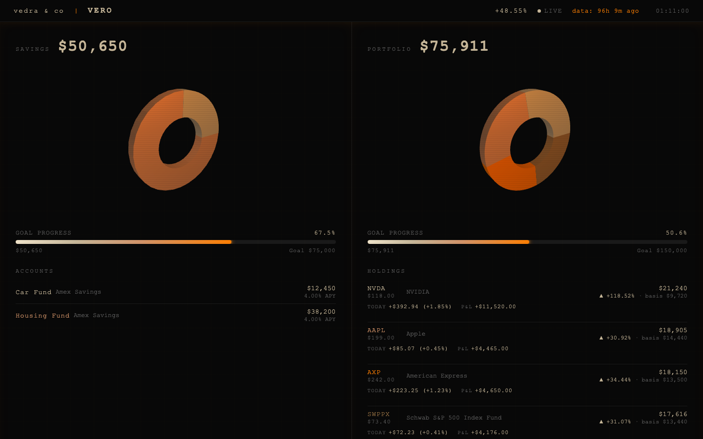

# Vero

> Wake up. Open terminal. Type `brief`.

Terminal portfolio tracker. Trades, P&L, daily brief, interactive dashboard — stored locally, no accounts.



---

## Install

Requires Python 3.9+

```bash
git clone https://github.com/Felixsavedra-1/portfolio-cli.git
cd portfolio-cli
sudo bash setup.sh
```

`sudo` required — installer writes to `/usr/local/bin/`.

---

## Quick start

```bash
portfolio buy AAPL 1000    # log a trade at live price
portfolio show             # view positions
brief                      # morning brief + dashboard
```

Data lives in `~/.portfolio/`. Created automatically on first use.

---

## Morning brief

```
════════════════════════════════════════════════════════════════════════
  Vero  ·  Monday, April 20, 2026  8:02 AM ET
  @vedra&co
════════════════════════════════════════════════════════════════════════

Savings

  Bank       Account              Balance      APY    Interest/mo
  ────────────────────────────────────────────────────────────────────────────
  Amex       Car                $5,200.00    3.20%    +$13.87/mo
  Amex       Housing            $8,400.00    3.20%    +$22.40/mo
  ────────────────────────────────────────────────────────────────────────────
             Total             $13,600.00             +$36.27/mo

Portfolio

  Value     $72,450.00
  Invested  $46,440.00  ·  since Mar 15, 2022

  Ticker     Price    Wt       $P&L        1D        1W        1M       YTD
  ────────────────────────────────────────────────────────────────────────────
  NVDA     $118.20   33%    +$437.34   +1.85%   +3.20%  +18.50%   +42.10%
              mkt $23,640.00  ·  cost $10,000.00  ·  gain +$13,640.00 (+136.40%)
  AAPL     $199.50   22%     +$71.82   +0.45%   -1.10%   +4.20%   +14.30%
              mkt $15,960.00  ·  cost $12,000.00  ·  gain +$3,960.00 (+33.00%)
  AXP      $242.10   20%    +$178.67   +1.23%   +3.10%  +18.50%   +38.20%
              mkt $14,526.00  ·  cost $11,000.00  ·  gain +$3,526.00 (+32.05%)
  SWPPX *   $73.40   24%     +$69.22   +0.41%   +1.20%   +4.80%   +12.30%
              mkt $16,882.00  ·  cost $13,440.00  ·  gain +$3,442.00 (+25.61%)
  ────────────────────────────────────────────────────────────────────────────
  Portfolio    —       —    +$757.05   +1.05%   +1.55%  +10.90%   +25.60%
  S&P 500      —       —           —   +0.30%   +0.80%   +3.10%    +8.40%
  Alpha        —       —           —   +0.75%   +0.75%   +7.80%   +17.20%

Watchlist

  Company              Ticker    Price       1D        1W        1M   Signal
  ────────────────────────────────────────────────────────────────────────────
  American Express     AXP    $242.10   +1.23%   +3.10%  +18.50%   ▲ BULLISH   strong momentum
  JPMorgan             JPM    $248.30   +0.15%   +0.40%   +1.20%   ~ NEUTRAL   mixed signals
  Apple                AAPL   $199.50   +0.45%   -1.10%   +4.20%   ▲ BULLISH   dip in uptrend
  Nvidia               NVDA   $118.20   +1.85%   +3.20%  +18.50%   ▲ BULLISH   strong momentum
  Tesla                TSLA   $248.90   -2.14%   -6.30%  -12.40%   ▼ BEARISH   downtrend
  Oklo                 OKLO    $42.80   +3.20%   +8.10%  +22.30%   ▲ BULLISH   strong momentum

Global markets  (local currency)

  S&P 500    (US)              ▲    +0.30%   today
  FTSE 100   (UK)              ▼    -0.12%   today
  Nikkei 225 (Japan)           ▲    +0.85%   today

Risk snapshot  (trailing 1 year)

  Sharpe 1.42 [0.98, 1.86]  ·  Volatility 14.2%  ·  Max Drawdown -8.3%

════════════════════════════════════════════════════════════════════════
```

`*` — mutual fund NAV updated after 4 PM ET, reflects prior close.

---

## Commands

```bash
# Trades
portfolio buy   TICKER DOLLARS [--price P] [--notes "..."]
portfolio sell  TICKER DOLLARS [--price P]
portfolio show
portfolio gains [--ticker TICKER]
portfolio history [--ticker TICKER] [--limit N]
portfolio remove TICKER

# Savings
portfolio savings set    NAME BALANCE [--apy RATE] [--bank NAME]
portfolio savings remove NAME

# Goals
portfolio goal set portfolio|savings AMOUNT
portfolio goal remove portfolio|savings
portfolio goal show
```

---

## Dashboard

```bash
brief                 # brief + open dashboard
python dashboard.py   # dashboard only
```

Click any company name in the watchlist to open a live analysis: returns across five windows, annualized volatility, max drawdown, and a switchable price chart — all computed from data already on the page.

> On headless servers, the HTML is written to `~/.portfolio/dashboard.html`. Copy the path or `scp` the file to view it.

---

## Configuration

Overrides go in `config_local.py` (gitignored):

```python
WATCHLIST = {
    'JPM':  'JPMorgan',
    'NVDA': 'Nvidia',
}
```

| Setting | Default | Description |
|:---|:---|:---|
| `WATCHLIST` | `{}` | Tickers in the watchlist |
| `MUTUAL_FUNDS` | `frozenset()` | NAV-lagged tickers, flagged `*` in the brief |
| `BENCHMARK` | `SPY` | Benchmark for alpha |
| `RISK_FREE_RATE` | `0.045` | Annual risk-free rate for Sharpe |
| `INTEREST_PAYMENT_DAY` | `None` | Day of month savings interest is credited |
| `BRIEF_TIMEZONE` | `America/New_York` | Timezone for the brief header |

---

## Deep analysis

```bash
python portfolio_analyzer.py
```

CAGR, Sharpe with Lo (2002) confidence intervals, volatility, max drawdown — for the portfolio, benchmark, and each position. Saves a 6-panel chart to `~/.portfolio/portfolio_analysis.png`.

---

## Tests

```bash
pytest tests/
```

All tests are network-free.

---


